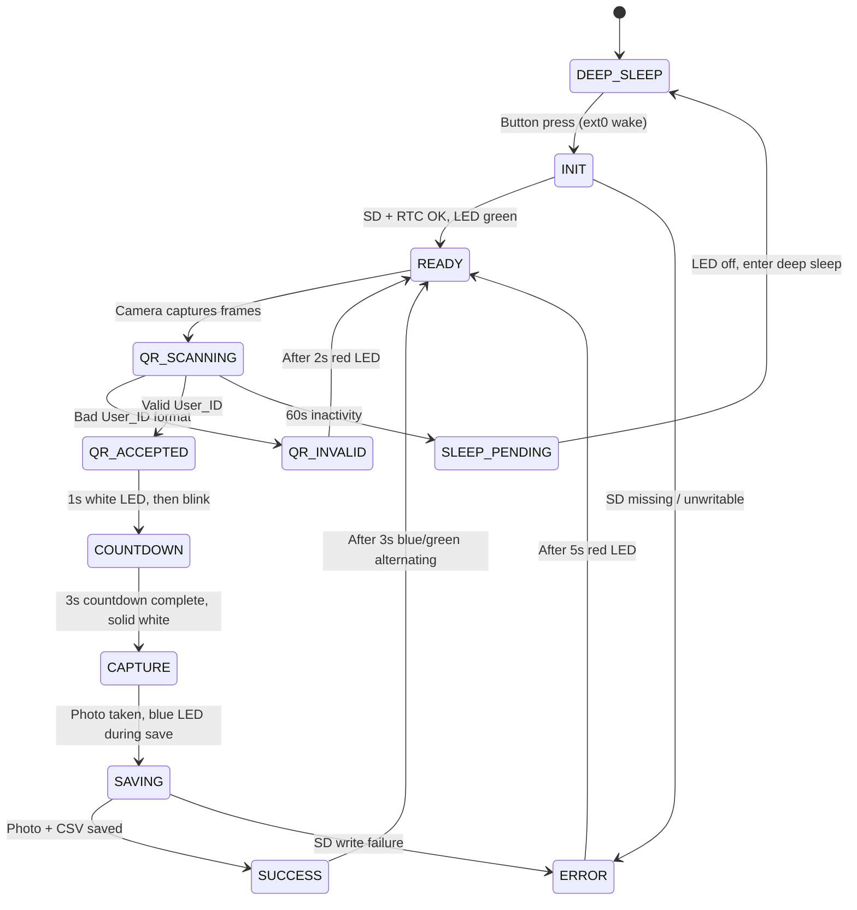

# Design Document: Wilderness QR Checkpoint Device

## Overview

This design describes the firmware and software architecture for a battery-powered ESP32-CAM checkpoint device used in wilderness events. The device operates fully offline: it wakes from deep sleep on button press, scans a user's QR code via the OV2640 camera, captures a proof-of-presence photo, stores the photo and a CSV log entry to an SD card, and returns to sleep after inactivity.

The system consists of two deployable components:
1. **Device Firmware** — C/C++ firmware running on the ESP32-CAM (Arduino framework), managing the full scan lifecycle, LED feedback, power management, and SD card storage.
2. **Phone App** — A mobile application (out of scope for this firmware design) that generates and displays user QR codes, and optionally logs scans locally for later sync.

This design focuses exclusively on the Device Firmware.

### Key Design Decisions

- **Arduino framework over ESP-IDF**: Simpler development, broad library ecosystem for camera, QR decoding, RTC, and SD card. Sufficient for the performance requirements.
- **quirc library for QR decoding**: Lightweight C library that runs on ESP32 with limited RAM. Decodes from grayscale frames captured by the camera.
- **Sequential camera/SD access**: The ESP32-CAM shares GPIO pins between the camera and SD card interfaces. The firmware must deinitialize the camera before writing to SD, then reinitialize it afterward.
- **Single-file state machine**: The firmware runs as a linear state machine in `loop()`, avoiding RTOS task complexity for this single-threaded workflow.
- **Overwrite-on-rescan photo strategy**: Only the latest photo per user is kept, saving SD space. The CSV log retains all scan records for audit.

## Architecture

The firmware is structured as a state machine driven by the main `loop()` function. Each state corresponds to a phase of the scan lifecycle.



### Wake and Sleep Flow

1. Device is in ESP32 deep sleep (ext0 wake source on button GPIO).
2. Button press triggers wake. Firmware runs `setup()`: initializes I2C (RTC), SD card check, camera init, LED green.
3. On 60s inactivity timeout, firmware deinitializes peripherals, turns off LED, enters deep sleep.

### Scan Lifecycle Flow

1. **READY**: Camera is active, continuously grabbing frames and attempting QR decode via quirc.
2. **QR_ACCEPTED**: Valid User_ID extracted. White LED solid 1s. Inactivity timer resets.
3. **COUNTDOWN**: White/green alternating blink with accelerating frequency (500ms → 100ms over 3s), ending on solid white.
4. **CAPTURE**: Solid white. Camera captures a single VGA JPEG frame.
5. **SAVING**: Camera deinitialized. LED switches to solid blue (GPIO 33 only — red/green pins released for SD). SD card initialized. Photo saved (overwrite if exists). CSV row appended. SD deinitialized. Blue LED stays on for minimum 1.5s total (or longer if save takes longer). Camera reinitialized, red/green LEDC reattached.
6. **SUCCESS**: Blue/green alternating (100ms each) for 3s. Return to READY.

## Components and Interfaces

### 1. Main State Machine (`main.ino`)

The top-level Arduino sketch. Manages state transitions, calls into subsystem modules.

```
enum DeviceState {
  STATE_INIT,
  STATE_READY,
  STATE_QR_SCANNING,
  STATE_QR_INVALID,
  STATE_QR_ACCEPTED,
  STATE_COUNTDOWN,
  STATE_CAPTURE,
  STATE_SAVING,
  STATE_SUCCESS,
  STATE_ERROR,
  STATE_SLEEP_PENDING
};
```

**Interface**: Calls all modules below. No module calls back into the state machine.

### 2. LED Controller (`led_controller.h` / `led_controller.cpp`)

Manages the KY-016 RGB LED via ESP32 LEDC PWM.

```cpp
namespace LED {
  void init(uint8_t pinR, uint8_t pinG, uint8_t pinB);
  void setColor(uint8_t r, uint8_t g, uint8_t b);
  void off();
  void green();                                  // Solid green — ready
  void red();                                    // Solid red — error/invalid
  void blue();                                   // Solid blue — saving (GPIO 33 only)
  void white();                                  // Solid white — QR accepted / capture
  void blinkWhiteGreen(unsigned long intervalMs); // Non-blocking alternating white/green
  void blinkBlueGreen(unsigned long intervalMs);  // Non-blocking alternating blue/green
  void detachSharedPins();                       // Detach LEDC from GPIO 12/13 before SD access
  void reattachSharedPins();                     // Reattach LEDC to GPIO 12/13 after SD access
  void update();                                 // Call each loop iteration for non-blocking blink
}
```

- Uses 3 LEDC channels (channels 0–2) at 5kHz, 8-bit resolution.
- `blinkWhiteGreen()` alternates between white and green at the given interval; `blinkBlueGreen()` alternates blue and green.
- `update()` toggles based on `millis()`.
- `detachSharedPins()` / `reattachSharedPins()` manage GPIO 12/13 handoff to/from SD_MMC.
- During SD operations, only `blue()` is available (GPIO 33).
- GPIO pins chosen from available ESP32-CAM pins (not conflicting with camera/SD).

### 3. QR Scanner (`qr_scanner.h` / `qr_scanner.cpp`)

Handles camera frame capture and QR decoding.

```cpp
namespace QRScanner {
  bool init();                          // Initialize OV2640 camera
  void deinit();                        // Release camera resources
  ScanResult scan();                    // Grab frame, attempt QR decode
  bool isValidUserId(const String& id); // Validate 4-digit zero-padded format
}

struct ScanResult {
  bool found;
  String userId;    // Raw decoded string
  bool valid;       // true if userId matches expected format
};
```

- Uses `esp_camera` API for frame capture.
- Converts JPEG frame to grayscale for quirc decoding.
- `isValidUserId()`: checks length == 4, all digits, range 0001–1000.

### 4. Photo Capture (`photo_capture.h` / `photo_capture.cpp`)

Captures a single JPEG photo at VGA resolution.

```cpp
namespace PhotoCapture {
  bool init();                    // Initialize camera for photo mode
  void deinit();                  // Release camera
  CaptureResult capture();       // Take single VGA JPEG frame
}

struct CaptureResult {
  bool success;
  uint8_t* data;      // JPEG buffer (owned by esp_camera)
  size_t length;       // JPEG size in bytes
};
```

- Camera is configured for VGA (640x480), JPEG quality tuned to keep files ≤50KB.
- After capture, the frame buffer is held until the caller releases it via `esp_camera_fb_return()`.

### 5. Storage Manager (`storage_manager.h` / `storage_manager.cpp`)

Handles all SD card operations: photo save, CSV append, health checks.

```cpp
namespace Storage {
  bool init();                                          // Mount SD card (SD_MMC)
  void deinit();                                        // Unmount SD card
  bool isReady();                                       // Check SD present + writable
  bool savePhoto(const char* deviceId, const char* userId,
                 const uint8_t* data, size_t length);   // Save/overwrite JPEG
  bool appendScanLog(const char* deviceId, const char* userId,
                     const char* timestamp);             // Append CSV row
  bool ensureDirectory(const char* deviceId);           // Create /DEVICEXX/ if needed
}
```

- File path: `/DEVICEXX/DEVICEXX_USERXXXX.jpg`
- CSV path: `/DEVICEXX/scan_log.csv`
- CSV header written on first append if file doesn't exist: `user_id,device_id,timestamp`
- Uses `SD_MMC` library in 1-bit mode to reduce GPIO usage.

### 6. RTC Manager (`rtc_manager.h` / `rtc_manager.cpp`)

Interfaces with the DS3231 RTC module over I2C.

```cpp
namespace RTC {
  bool init();                    // Initialize I2C, check DS3231 presence
  String getTimestamp();          // Returns ISO 8601 string or fallback
  bool isAvailable();             // True if RTC responds on I2C
}
```

- Uses `RTClib` (Adafruit) for DS3231 communication.
- I2C on GPIO 14 (SCL) and GPIO 15 (SDA) — available pins on ESP32-CAM.
- Fallback timestamp: `"0000-00-00T00:00:00"` if RTC unresponsive.

### 7. Inactivity Timer (`inactivity_timer.h` / `inactivity_timer.cpp`)

Tracks idle time and triggers sleep.

```cpp
namespace InactivityTimer {
  void reset();                   // Reset to 0 (call after each scan)
  bool isExpired();               // True if 60s elapsed since last reset
  void init(unsigned long timeoutMs = 60000);
}
```

- Based on `millis()` comparison. Simple and reliable.

### GPIO Pin Allocation

| Pin    | Function              | Notes                                    |
|--------|-----------------------|------------------------------------------|
| GPIO 0 | Button (wake + input) | ext0 wake source, internal pull-up       |
| GPIO 2 | LED Red (KY-016)      | LEDC channel 0. Also SD_MMC D0 — see note|
| GPIO 12| LED Green (KY-016)    | LEDC channel 1. Shared with SD_MMC — must manage carefully |
| GPIO 13| LED Blue (KY-016)     | LEDC channel 2. Shared with SD_MMC — must manage carefully |
| GPIO 14| I2C SCL (DS3231)      | Also SD_MMC CLK — shared, managed by sequential access |
| GPIO 15| I2C SDA (DS3231)      | Also SD_MMC CMD — shared, managed by sequential access |

**Critical constraint**: GPIO 2, 12, 13, 14, 15 are shared between SD_MMC and other functions. The firmware handles this by:
- LED pins are reconfigured as LEDC PWM outputs when SD is not in use.
- Before SD access: LED off, detach LEDC, SD_MMC init.
- After SD access: SD_MMC deinit, reattach LEDC, restore LED state.
- I2C (RTC) and SD_MMC share GPIO 14/15. RTC reads happen before SD operations or after SD deinit.

### Revised GPIO Strategy

Given the severe pin constraints, a more practical approach:

| Pin    | Function              | Notes                                    |
|--------|-----------------------|------------------------------------------|
| GPIO 0 | Button (wake)         | ext0 deep sleep wake source              |
| GPIO 2 | SD_MMC D0             | Required for SD card (1-bit mode)        |
| GPIO 12| KY-016 Red            | Free when SD not in use                  |
| GPIO 13| KY-016 Green          | Free when SD not in use                  |
| GPIO 14| SD_MMC CLK / I2C SCL  | Time-multiplexed                         |
| GPIO 15| SD_MMC CMD / I2C SDA  | Time-multiplexed                         |
| GPIO 16| KY-016 Blue           | PSRAM pin — only if PSRAM not used       |

**Alternative if PSRAM needed**: Use GPIO 33 (onboard LED pin, active low) for a single status indicator instead of full RGB, or use a shift register on fewer pins. For this design, we assume PSRAM is available and use GPIO 16 cautiously, or remap blue to GPIO 33 with inverted logic.

**Final practical pin assignment** (assuming 1-bit SD_MMC mode and no PSRAM dependency for QR scanning):

| Pin    | Primary Function      | Secondary Function    |
|--------|-----------------------|-----------------------|
| GPIO 0 | Wake button           | —                     |
| GPIO 2 | SD_MMC D0             | —                     |
| GPIO 12| KY-016 Red            | (detach during SD)    |
| GPIO 13| KY-016 Green          | (detach during SD)    |
| GPIO 14| I2C SCL (RTC)         | SD_MMC CLK            |
| GPIO 15| I2C SDA (RTC)         | SD_MMC CMD            |
| GPIO 33| KY-016 Blue           | (onboard LED, inverted)|

Note: GPIO 33 is the onboard LED on ESP32-CAM (active low). We repurpose it for blue, accepting inverted logic in the LED controller.

## Data Models

### Device Configuration (compile-time constants)

```cpp
#define DEVICE_ID        "01"          // 2-digit zero-padded
#define MAX_USERS        1000
#define PHOTO_QUALITY    12            // JPEG quality (10-63, lower = better)
#define VGA_WIDTH        640
#define VGA_HEIGHT       480
#define MAX_PHOTO_SIZE   50000         // 50KB max
#define INACTIVITY_MS    60000         // 60 seconds
#define COUNTDOWN_MS     3000          // 3-second countdown
#define BLINK_START_MS   500           // Initial blink interval
#define BLINK_END_MS     100           // Final blink interval
#define ACCEPTED_MS      1000          // White solid duration after QR accept
#define CAPTURE_FLASH_MS 200           // White solid during capture
#define SAVE_MIN_MS      1500          // Minimum blue LED during save (1.5s)
#define SUCCESS_MS       3000          // Blue/green alternating duration
#define SUCCESS_BLINK_MS 100           // Blue/green alternating interval
#define ERROR_MS         5000          // Red solid for SD errors
#define INVALID_MS       2000          // Red solid for invalid QR
```

### Scan Log Record (CSV)

| Column     | Type   | Format                    | Example              |
|------------|--------|---------------------------|----------------------|
| user_id    | string | 4-digit zero-padded       | 0042                 |
| device_id  | string | 2-digit zero-padded       | 01                   |
| timestamp  | string | ISO 8601                  | 2025-07-15T14:32:07  |

CSV file header: `user_id,device_id,timestamp`

Example rows:
```
user_id,device_id,timestamp
0042,01,2025-07-15T14:32:07
0001,01,2025-07-15T14:33:15
0042,01,2025-07-15T15:01:22
```

Note: User 0042 appears twice — rescans append new rows, they don't replace.

### Photo File

- Format: JPEG, VGA 640x480
- Max size: 50KB
- Path: `/DEVICEXX/DEVICEXX_USERXXXX.jpg`
- Example: `/DEVICE01/DEVICE01_USER0042.jpg`
- Overwrites on rescan (only latest photo kept per user per device).

### SD Card Directory Structure

```
/DEVICE01/
  scan_log.csv
  DEVICE01_USER0001.jpg
  DEVICE01_USER0042.jpg
  DEVICE01_USER0999.jpg
  ...
```

### State Machine Data

```cpp
struct DeviceContext {
  DeviceState currentState;
  String currentUserId;           // User_ID from last valid QR scan
  unsigned long stateEnteredAt;   // millis() when current state began
  unsigned long lastScanAt;       // millis() of last completed scan (for inactivity)
  unsigned long countdownStartAt; // millis() when countdown began
  bool sdReady;                   // SD card health status
  bool rtcReady;                  // RTC health status
};
```


## Correctness Properties

*A property is a characteristic or behavior that should hold true across all valid executions of a system — essentially, a formal statement about what the system should do. Properties serve as the bridge between human-readable specifications and machine-verifiable correctness guarantees.*

### Property 1: User_ID validation accepts only correctly formatted IDs

*For any* string, `isValidUserId()` should return true if and only if the string is exactly 4 characters long, consists entirely of digits, and represents a number in the range 0001–1000. All other strings (empty, wrong length, non-digit characters, out-of-range numbers like "0000" or "1001") should be rejected.

**Validates: Requirements 2.2**

### Property 2: Countdown blink interval is monotonically decreasing

*For any* two elapsed times t1 and t2 within the countdown period [0, 3000ms] where t1 < t2, the computed blink interval at t1 should be greater than or equal to the blink interval at t2. The interval at t=0 should be 500ms and at t=3000ms should be 100ms. The blink alternates between white and green colors at the computed interval.

**Validates: Requirements 3.1**

### Property 3: File path construction is deterministic and correctly formatted

*For any* valid Device_ID (2-digit zero-padded, "01"–"99") and valid User_ID (4-digit zero-padded, "0001"–"1000"), the constructed photo file path should equal `/DEVICE{Device_ID}/DEVICE{Device_ID}_USER{User_ID}.jpg`. Calling the path construction function twice with the same inputs should produce identical results (guaranteeing overwrite-on-rescan behavior).

**Validates: Requirements 3.4, 3.5, 9.1, 13.1**

### Property 4: CSV scan log record round-trip

*For any* valid User_ID, Device_ID, and ISO 8601 timestamp string, formatting a scan log record as CSV and then parsing that CSV row back should yield the original User_ID, Device_ID, and timestamp values unchanged.

**Validates: Requirements 4.1, 4.2, 13.2**

### Property 5: Scan log append preserves all previous records

*For any* sequence of N valid scan events (each with a User_ID, Device_ID, and timestamp), appending all N records to the scan log should result in a log containing exactly N data rows (plus the header row). No previously appended record should be lost or modified.

**Validates: Requirements 4.3**

### Property 6: Inactivity timer correctness

*For any* timeout duration T and elapsed time E: after a reset, `isExpired()` should return false when E < T and true when E >= T. Calling `reset()` at any point should restart the countdown, making `isExpired()` return false for the next T milliseconds.

**Validates: Requirements 6.1, 6.2**

## Error Handling

### SD Card Errors

| Scenario                  | Behavior                                              | Requirement |
|---------------------------|-------------------------------------------------------|-------------|
| SD card missing at boot   | Solid red LED, remain in ERROR state, retry on next wake | 7.3      |
| SD card unwritable        | Solid red LED 5s, return to READY                     | 4.4         |
| Photo save fails          | Solid red LED 5s, return to READY, no CSV entry       | 4.4         |
| CSV append fails          | Solid red LED 5s, return to READY (photo may exist)   | 4.4         |
| SD card full              | Solid red LED 5s, return to READY                     | 4.4         |

### RTC Errors

| Scenario                  | Behavior                                              | Requirement |
|---------------------------|-------------------------------------------------------|-------------|
| RTC unresponsive at boot  | Set `rtcReady = false`, continue operation             | 8.2         |
| RTC returns invalid time  | Use fallback timestamp `"0000-00-00T00:00:00"`        | 8.2         |

### QR Scanning Errors

| Scenario                  | Behavior                                              | Requirement |
|---------------------------|-------------------------------------------------------|-------------|
| Invalid User_ID format    | Solid red LED 2s, return to READY                     | 2.3         |
| No QR detected in frame   | Continue scanning (no user feedback)                  | 2.1         |
| Camera init failure       | Solid red LED, remain in ERROR state                  | —           |

### GPIO Conflict Handling

The shared GPIO pins between SD card, LED, and I2C require careful sequencing:

1. **Before SD access**: Detach LEDC from GPIO 12/13 (red/green) via `LED::detachSharedPins()`, switch to blue-only (GPIO 33), deinit camera, init SD_MMC. Blue LED stays solid during save.
2. **After SD access**: Deinit SD_MMC, reattach LEDC to GPIO 12/13 via `LED::reattachSharedPins()`, reinit camera.
3. **RTC access**: Only when SD_MMC is not active (I2C shares GPIO 14/15 with SD_MMC CLK/CMD).

LED states during GPIO-constrained operations:
- **SAVING state**: Only blue (GPIO 33) is available. Red and green pins belong to SD_MMC.
- **All other states**: Full RGB available (white, green, red, blue/green alternating).

If any peripheral fails to reinitialize after a GPIO swap, the device enters ERROR state with red LED and attempts recovery on the next state transition.

## Testing Strategy

### Testing Environment

- **Host-based unit tests**: Pure logic modules (User_ID validation, file path construction, CSV formatting, countdown interval calculation, inactivity timer) are tested on the host machine using a C++ test framework.
- **Hardware-in-the-loop tests**: Camera capture, SD card I/O, RTC reads, LED output, and deep sleep are tested on actual ESP32-CAM hardware via serial monitor assertions.
- **Framework**: Google Test (gtest) for host-based C++ unit tests. `fast-check` (if using a TypeScript test harness) or a C++ PBT library like [RapidCheck](https://github.com/emil-e/rapidcheck) for property-based tests.

Given the firmware is C/C++ (Arduino), we use **RapidCheck** as the property-based testing library. It integrates with Google Test and supports generating arbitrary inputs.

### Unit Tests (Examples and Edge Cases)

- **User_ID validation**: Test specific known-good IDs ("0001", "0500", "1000") and known-bad inputs ("", "0000", "1001", "abcd", "00001", "1").
- **File path construction**: Test specific device/user combos produce expected paths (e.g., "01"/"0042" → "/DEVICE01/DEVICE01_USER0042.jpg").
- **CSV formatting**: Test a specific record formats correctly, header row is correct.
- **State machine transitions**: Test that READY + valid QR → QR_ACCEPTED, READY + invalid QR → QR_INVALID, etc.
- **RTC fallback**: Test that when RTC is unavailable, timestamp is "0000-00-00T00:00:00".
- **SD card missing at boot**: Test that init returns false and state is ERROR.
- **LED state per device state**: Test that each state sets the expected LED color.

### Property-Based Tests (RapidCheck)

Each property test runs a minimum of 100 iterations with randomly generated inputs.

- **Feature: wilderness-qr-checkpoint, Property 1: User_ID validation accepts only correctly formatted IDs**
  Generate arbitrary strings. Assert `isValidUserId()` returns true iff the string is exactly 4 digits representing 0001–1000.

- **Feature: wilderness-qr-checkpoint, Property 2: Countdown blink interval is monotonically decreasing**
  Generate pairs of elapsed times (t1, t2) in [0, 3000] where t1 < t2. Assert `computeBlinkInterval(t1) >= computeBlinkInterval(t2)`.

- **Feature: wilderness-qr-checkpoint, Property 3: File path construction is deterministic and correctly formatted**
  Generate valid Device_IDs and User_IDs. Assert the path matches the expected pattern and calling the function twice yields the same result.

- **Feature: wilderness-qr-checkpoint, Property 4: CSV scan log record round-trip**
  Generate valid User_IDs, Device_IDs, and ISO 8601 timestamps. Format as CSV, parse back, assert equality.

- **Feature: wilderness-qr-checkpoint, Property 5: Scan log append preserves all previous records**
  Generate a list of N scan records (1–100). Append all to an in-memory log. Assert the log contains exactly N data rows and each row matches the input.

- **Feature: wilderness-qr-checkpoint, Property 6: Inactivity timer correctness**
  Generate timeout values and elapsed times. Assert `isExpired()` returns the correct boolean based on whether elapsed >= timeout.

### Test Configuration

```cpp
// RapidCheck configuration for all property tests
rc::prop("property name", [](/* generated args */) {
    // ... assertions ...
});
// Each property runs with default 100 iterations minimum
```

### What Is NOT Tested in Software

- Camera image quality and JPEG size (hardware-dependent)
- Deep sleep current draw (hardware measurement)
- Physical button debouncing (hardware)
- LED color accuracy (visual inspection)
- SD card FAT32 compatibility (standard library)
- Sustained throughput over 30 minutes (system-level bench test on hardware)
