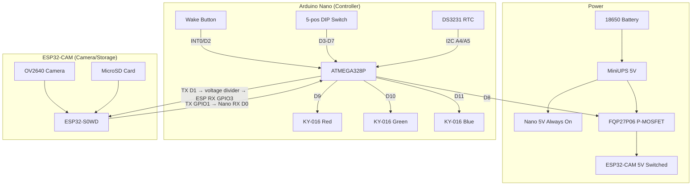
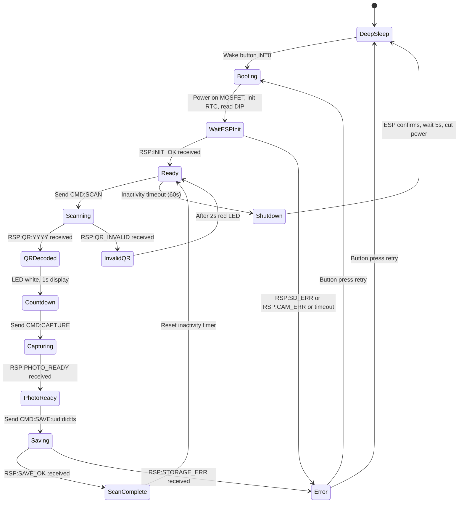
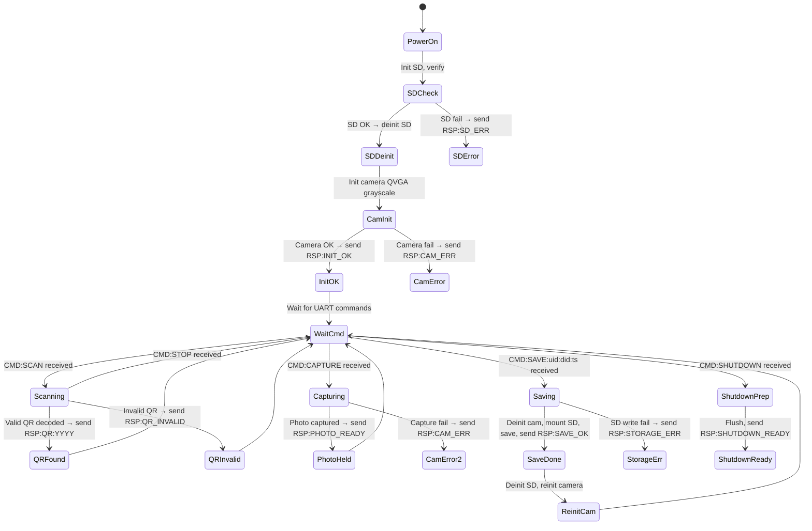
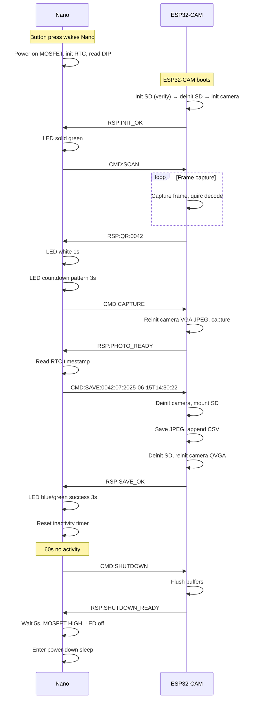

# Design Document: Wilderness QR Checkpoint

## Overview

This design describes a two-board wilderness QR checkpoint device. An Arduino Nano (ATMEGA328P) serves as the always-on controller managing power, user interface (LED + button), RTC timekeeping, and device configuration. An ESP32-CAM (AI-Thinker) handles camera-based QR scanning, photo capture, and SD card storage. The Nano controls ESP32-CAM power via a P-channel MOSFET, enabling true power-off during sleep for minimal battery drain.

The system lifecycle is: sleep → wake (button) → boot ESP32-CAM → scan QR → capture photo → save to SD → return to ready → sleep after 60s inactivity.

Communication between boards uses a newline-terminated ASCII UART protocol at 115200 baud with voltage level shifting.

## Architecture

### System Block Diagram



### State Machine — Nano Main Loop



### State Machine — ESP32-CAM



### Design Decisions

1. **Nano as controller, ESP32-CAM as peripheral**: The Nano's deterministic behavior and low sleep current (~5µA in power-down) make it ideal for power management. The ESP32-CAM's deep sleep still draws ~5-10mA due to the camera regulator; cutting power entirely via MOSFET eliminates this.

2. **Camera/SD GPIO sharing**: The ESP32-CAM shares GPIO pins between the camera and SD card interfaces. The design explicitly deinitializes the camera before mounting SD and vice versa. This is a hardware constraint of the AI-Thinker board.

3. **ASCII UART protocol**: Human-readable protocol simplifies debugging with a serial monitor. The 64-byte message limit fits well within UART buffers on both platforms.

4. **Timestamp from Nano's RTC**: The DS3231 is on the Nano's I2C bus. The Nano reads the time and passes it to the ESP32-CAM in the save command, avoiding the need for I2C on the ESP32-CAM (which would conflict with camera pins).

5. **DIP switch for Device ID**: Physical switches avoid recompilation for each device. Binary encoding of 5 switches gives 1-32 range (0 reserved as invalid).

## Components and Interfaces

### PlatformIO Project Structure

The project uses PlatformIO with two build environments:

```
platformio.ini          # Two environments: nano, esp32cam
src/
  nano/
    main.cpp            # Nano entry point and main state machine
    uart_protocol.h     # UART command/response send/parse (Nano side)
    uart_protocol.cpp
    led_controller.h    # KY-016 RGB LED patterns
    led_controller.cpp
    power_manager.h     # MOSFET control, sleep, wake interrupt
    power_manager.cpp
    rtc_manager.h       # DS3231 read, format ISO 8601
    rtc_manager.cpp
    config_reader.h     # DIP switch reading, Device ID
    config_reader.cpp
  esp32cam/
    main.cpp            # ESP32-CAM entry point and command dispatcher
    uart_protocol.h     # UART command/response send/parse (ESP32 side)
    uart_protocol.cpp
    qr_scanner.h        # Camera init (QVGA), quirc decode loop
    qr_scanner.cpp
    photo_capture.h     # Camera reinit (VGA JPEG), single capture
    photo_capture.cpp
    sd_storage.h        # SD mount/unmount, save photo, append CSV
    sd_storage.cpp
```

### Component Interfaces — Nano Side

#### `uart_protocol.h` (Nano)

```cpp
#ifndef NANO_UART_PROTOCOL_H
#define NANO_UART_PROTOCOL_H

#include <Arduino.h>

// Maximum UART message length including newline
static const uint8_t UART_MAX_MSG_LEN = 64;

// Command timeout in milliseconds
static const uint16_t UART_TIMEOUT_MS = 500;

// Maximum retry count for failed commands
static const uint8_t UART_MAX_RETRIES = 2;

// Response status codes from ESP32-CAM
enum class EspResponse : uint8_t {
    INIT_OK,
    QR_FOUND,        // Followed by :YYYY user_id
    QR_INVALID,
    PHOTO_READY,
    SAVE_OK,
    SHUTDOWN_READY,
    SD_ERR,
    CAM_ERR,
    STORAGE_ERR,
    PARSE_ERR,
    TIMEOUT,         // Internal: no response received
    UNKNOWN          // Internal: unrecognized response
};

struct ParsedResponse {
    EspResponse status;
    char data[16];   // Optional payload (e.g., user_id "0001")
};

// Send a command and wait for response with retries.
// Returns parsed response. On timeout after all retries, returns TIMEOUT.
// command: full command string without newline (e.g., "CMD:SCAN")
ParsedResponse sendCommand(const char* command);

// Send a command without waiting for response (used for CMD:STOP).
void sendCommandNoWait(const char* command);

// Parse a raw response line into a ParsedResponse struct.
ParsedResponse parseResponse(const char* line);

// Initialize UART at 115200 baud.
void uartInit();

#endif
```

#### `led_controller.h`

```cpp
#ifndef LED_CONTROLLER_H
#define LED_CONTROLLER_H

#include <Arduino.h>

// Pin assignments for KY-016 RGB LED
static const uint8_t PIN_LED_R = 9;
static const uint8_t PIN_LED_G = 10;
static const uint8_t PIN_LED_B = 11;

// LED color presets (R, G, B values 0-255)
struct LedColor {
    uint8_t r, g, b;
};

static const LedColor COLOR_OFF     = {0, 0, 0};
static const LedColor COLOR_RED     = {255, 0, 0};
static const LedColor COLOR_GREEN   = {0, 255, 0};
static const LedColor COLOR_BLUE    = {0, 0, 255};
static const LedColor COLOR_WHITE   = {255, 255, 255};

// Initialize LED pins as OUTPUT and turn off.
void ledInit();

// Set LED to a solid color.
void ledSolid(LedColor color);

// Turn LED off.
void ledOff();

// Non-blocking LED pattern update. Call from loop().
// Manages timed patterns (blink, accelerating blink, alternating).
void ledUpdate();

// Start accelerating white/green blink pattern over durationMs.
void ledStartCountdown(uint16_t durationMs);

// Start alternating blue/green blink pattern for durationMs.
void ledStartSuccessPattern(uint16_t durationMs);

// Start blinking red pattern (for invalid DIP config).
void ledStartErrorBlink();

// Returns true if a timed pattern is currently active.
bool ledPatternActive();

#endif
```

#### `power_manager.h`

```cpp
#ifndef POWER_MANAGER_H
#define POWER_MANAGER_H

#include <Arduino.h>

// MOSFET gate pin (active LOW to power on ESP32-CAM)
static const uint8_t PIN_MOSFET_GATE = 8;

// Wake button pin (INT0 on D2)
static const uint8_t PIN_WAKE_BUTTON = 2;

// Initialize MOSFET pin (HIGH = ESP off), button pin with pull-up.
void powerInit();

// Power on ESP32-CAM: drive MOSFET gate LOW.
void espPowerOn();

// Power off ESP32-CAM: drive MOSFET gate HIGH.
void espPowerOff();

// Enter Nano power-down sleep mode. Wakes on INT0 (button press).
// Before calling: ensure LED is off, MOSFET gate HIGH.
void enterDeepSleep();

// Attach wake interrupt on button pin (falling edge).
void attachWakeInterrupt();

#endif
```

#### `rtc_manager.h`

```cpp
#ifndef RTC_MANAGER_H
#define RTC_MANAGER_H

#include <Arduino.h>

// Initialize DS3231 RTC over I2C (A4/SDA, A5/SCL).
// Returns true if RTC responds, false otherwise.
bool rtcInit();

// Read current time and format as ISO 8601 string.
// Writes to buffer (must be at least 20 bytes: "YYYY-MM-DDTHH:MM:SS\0").
// Returns true on success, false if RTC read fails.
bool rtcGetTimestamp(char* buffer, uint8_t bufferSize);

// Returns the fallback timestamp used when RTC is unavailable.
const char* rtcFallbackTimestamp();

#endif
```

#### `config_reader.h`

```cpp
#ifndef CONFIG_READER_H
#define CONFIG_READER_H

#include <Arduino.h>

// DIP switch pins (D3-D7), active LOW with internal pull-ups
static const uint8_t DIP_PINS[] = {3, 4, 5, 6, 7};
static const uint8_t DIP_PIN_COUNT = 5;

// Initialize DIP switch pins with internal pull-ups.
void configInit();

// Read DIP switches and return Device ID (1-32).
// Returns 0 if all switches are OFF (invalid configuration).
uint8_t configReadDeviceId();

// Format Device ID as 2-digit zero-padded string.
// Buffer must be at least 3 bytes.
void configFormatDeviceId(uint8_t deviceId, char* buffer);

#endif
```

### Component Interfaces — ESP32-CAM Side

#### `uart_protocol.h` (ESP32-CAM)

```cpp
#ifndef ESP_UART_PROTOCOL_H
#define ESP_UART_PROTOCOL_H

#include <Arduino.h>

static const uint8_t UART_MAX_MSG_LEN = 64;

// Parsed command from Nano
enum class NanoCommand : uint8_t {
    SCAN,
    STOP,
    CAPTURE,
    SAVE,       // Followed by :user_id:device_id:timestamp
    SHUTDOWN,
    UNKNOWN
};

struct ParsedCommand {
    NanoCommand command;
    char userId[5];      // "0001"-"1000", null-terminated
    char deviceId[3];    // "01"-"32", null-terminated
    char timestamp[20];  // "YYYY-MM-DDTHH:MM:SS", null-terminated
};

// Initialize UART at 115200 baud (Serial on GPIO1/GPIO3).
void uartInit();

// Send a response line. Appends newline automatically.
// Example: sendResponse("RSP:INIT_OK")
void sendResponse(const char* response);

// Read a complete command line (blocking with timeout).
// Returns true if a line was read, false on timeout.
bool readCommand(char* buffer, uint8_t bufferSize, uint16_t timeoutMs);

// Parse a raw command line into a ParsedCommand struct.
ParsedCommand parseCommand(const char* line);

// Validate a user_id string: 4 digits, value 0001-1000.
bool isValidUserId(const char* userId);

#endif
```

#### `qr_scanner.h`

```cpp
#ifndef QR_SCANNER_H
#define QR_SCANNER_H

#include <Arduino.h>

// QR scan result
enum class QrResult : uint8_t {
    FOUND_VALID,    // Valid user_id decoded
    FOUND_INVALID,  // QR decoded but not a valid user_id
    NO_QR,          // No QR code in frame
    CAM_ERROR       // Camera capture failed
};

struct QrScanResult {
    QrResult result;
    char userId[5];  // Populated only when result == FOUND_VALID
};

// Initialize camera in QVGA grayscale mode for QR scanning.
// Returns true on success.
bool qrScannerInit();

// Capture one frame and attempt QR decode.
// Non-blocking per frame; caller loops until QR found or stop.
QrScanResult qrScanOneFrame();

// Deinitialize camera (required before SD access).
void qrScannerDeinit();

#endif
```

#### `photo_capture.h`

```cpp
#ifndef PHOTO_CAPTURE_H
#define PHOTO_CAPTURE_H

#include <Arduino.h>

// Initialize camera in VGA JPEG mode for photo capture.
// Returns true on success.
bool photoCaptureInit();

// Capture a single JPEG photo. Returns pointer to JPEG buffer
// and sets jpegSize. Caller must call photoRelease() after use.
// Returns nullptr on failure.
const uint8_t* photoCaptureOne(size_t* jpegSize);

// Release the captured photo buffer.
void photoRelease();

// Deinitialize camera (required before SD access).
void photoCaptureDeinit();

#endif
```

#### `sd_storage.h`

```cpp
#ifndef SD_STORAGE_H
#define SD_STORAGE_H

#include <Arduino.h>

// Initialize SD card and create device directory if needed.
// deviceId: 2-digit zero-padded string (e.g., "01").
// Returns true on success.
bool sdInit(const char* deviceId);

// Verify SD card is present and writable (used during boot check).
// Mounts, checks, then unmounts.
// Returns true if SD is OK.
bool sdVerify();

// Save a JPEG photo to /DEVICEXX/DEVICEXX_USERYYYY.jpg.
// Overwrites if file exists.
// Returns true on success.
bool sdSavePhoto(const char* deviceId, const char* userId,
                 const uint8_t* jpegData, size_t jpegSize);

// Append a row to /DEVICEXX/scan_log.csv.
// Creates file with header if it doesn't exist.
// Returns true on success.
bool sdAppendLog(const char* deviceId, const char* userId,
                 const char* timestamp);

// Unmount SD card (required before camera reinit).
void sdDeinit();

#endif
```

### UART Protocol Specification

All messages are newline-terminated ASCII, max 64 bytes including `\n`.

#### Commands (Nano → ESP32-CAM)

| Command | Format | Description |
|---------|--------|-------------|
| Scan | `CMD:SCAN\n` | Start continuous QR scanning |
| Stop | `CMD:STOP\n` | Stop scanning (cancel) |
| Capture | `CMD:CAPTURE\n` | Capture VGA JPEG photo |
| Save | `CMD:SAVE:<user_id>:<device_id>:<timestamp>\n` | Save photo + append log |
| Shutdown | `CMD:SHUTDOWN\n` | Prepare for power off |

Example save command: `CMD:SAVE:0042:07:2025-06-15T14:30:22\n` (52 bytes)

#### Responses (ESP32-CAM → Nano)

| Response | Format | Description |
|----------|--------|-------------|
| Init OK | `RSP:INIT_OK\n` | Boot sequence complete |
| QR Found | `RSP:QR:<user_id>\n` | Valid QR decoded (e.g., `RSP:QR:0042\n`) |
| QR Invalid | `RSP:QR_INVALID\n` | QR decoded but invalid content |
| Photo Ready | `RSP:PHOTO_READY\n` | Photo captured and held in memory |
| Save OK | `RSP:SAVE_OK\n` | Photo + log saved to SD |
| Shutdown Ready | `RSP:SHUTDOWN_READY\n` | Safe to cut power |
| SD Error | `RSP:SD_ERR\n` | SD card init/write failure |
| Camera Error | `RSP:CAM_ERR\n` | Camera init/capture failure |
| Storage Error | `RSP:STORAGE_ERR\n` | SD full or write failure during save |
| Parse Error | `RSP:ERR:PARSE\n` | Malformed command received |

#### Protocol Sequence — Full Scan Cycle



## Data Models

### SD Card Directory Structure

```
/DEVICEXX/
  scan_log.csv
  DEVICEXX_USER0001.jpg
  DEVICEXX_USER0042.jpg
  ...
```

Where `XX` = 2-digit zero-padded Device_ID, `YYYY` = 4-digit zero-padded User_ID.

### Scan Log CSV Format

```csv
user_id,device_id,timestamp
0042,07,2025-06-15T14:30:22
0001,07,2025-06-15T14:31:05
0042,07,2025-06-15T15:12:44
```

- **user_id**: 4-digit zero-padded User_ID (string)
- **device_id**: 2-digit zero-padded Device_ID (string)
- **timestamp**: ISO 8601 format `YYYY-MM-DDTHH:MM:SS` (no timezone, local time from DS3231)
- Header row written on file creation only
- Rows are append-only; rescanning the same user appends a new row (does not overwrite)

### Photo File Naming

Pattern: `DEVICEXX_USERYYYY.jpg`

- Overwritten on rescan of same user on same device
- VGA JPEG (640×480), target ≤50KB per image

### QR Code Content Format

The QR code encodes a plain-text string representing the User_ID:
- Exactly 4 ASCII digit characters
- Numeric value in range 0001–1000
- Examples: `"0001"`, `"0042"`, `"1000"`
- Any other content is treated as invalid

### Device ID Encoding

5-position DIP switch, active LOW (ON = 0, OFF = 1):

| Switch 5 | Switch 4 | Switch 3 | Switch 2 | Switch 1 | Binary | Device ID |
|----------|----------|----------|----------|----------|--------|-----------|
| OFF | OFF | OFF | OFF | ON | 00001 | 01 |
| OFF | OFF | OFF | ON | OFF | 00010 | 02 |
| OFF | OFF | OFF | ON | ON | 00011 | 03 |
| ... | ... | ... | ... | ... | ... | ... |
| ON | OFF | OFF | OFF | OFF | 10000 | 16 |
| ON | ON | ON | ON | ON | 11111 | 31 |

Note: Since switches are active LOW, the Nano reads inverted values and inverts them in software. Binary `00000` (all OFF) = 0 = invalid configuration.

### Nano Pin Assignments

| Pin | Function | Notes |
|-----|----------|-------|
| D0 (RX) | UART RX from ESP32-CAM | 3.3V direct connection |
| D1 (TX) | UART TX to ESP32-CAM | Through 1kΩ + 2kΩ voltage divider |
| D2 (INT0) | Wake button | Internal pull-up, falling edge interrupt |
| D3 | DIP switch bit 0 (LSB) | Internal pull-up, active LOW |
| D4 | DIP switch bit 1 | Internal pull-up, active LOW |
| D5 | DIP switch bit 2 | Internal pull-up, active LOW |
| D6 | DIP switch bit 3 | Internal pull-up, active LOW |
| D7 | DIP switch bit 4 (MSB) | Internal pull-up, active LOW |
| D8 | MOSFET gate | HIGH = ESP off, LOW = ESP on |
| D9 | KY-016 Red | PWM capable |
| D10 | KY-016 Green | PWM capable |
| D11 | KY-016 Blue | PWM capable |
| A4 (SDA) | DS3231 I2C data | |
| A5 (SCL) | DS3231 I2C clock | |

### ESP32-CAM Pin Usage (AI-Thinker)

| Pin | Function | Notes |
|-----|----------|-------|
| GPIO1 (U0TXD) | UART TX to Nano | Direct 3.3V to Nano RX |
| GPIO3 (U0RXD) | UART RX from Nano | Via voltage divider from Nano TX |
| GPIO4 | SD card / Flash LED | Shared, flash LED disabled in software |
| GPIO2, 12, 13, 14, 15 | SD card interface | HS2 data/clock lines |
| GPIO5, 18, 19, 21, 22, 23, 25, 26, 27, 32, 33, 34, 35, 36, 39 | Camera interface | OV2640 data + control |

### Voltage Divider Circuit

```
Nano TX (D1, 5V) ──── 1kΩ ────┬──── ESP32-CAM RX (GPIO3)
                               │
                              2kΩ
                               │
                              GND

Vout = 5V × 2kΩ / (1kΩ + 2kΩ) = 3.33V
```

## Correctness Properties

*A property is a characteristic or behavior that should hold true across all valid executions of a system — essentially, a formal statement about what the system should do. Properties serve as the bridge between human-readable specifications and machine-verifiable correctness guarantees.*

### Property 1: UART Command Retry on Timeout

*For any* UART command sent by the Nano, if the ESP32-CAM does not respond within 500ms, the Nano shall retry up to 2 additional times (3 attempts total) before reporting an error. If any attempt succeeds, the successful response is returned.

**Validates: Requirements 1.5**

### Property 2: Inactivity Timeout with Scan Reset

*For any* sequence of scan events with associated timestamps, the system shall trigger a shutdown command if and only if the elapsed time since the last successful scan (or since wake, if no scan has occurred) exceeds 60 seconds. Each successful scan resets the timer to 60 seconds.

**Validates: Requirements 2.2, 2.5**

### Property 3: User ID Validation

*For any* string, `isValidUserId` shall return true if and only if the string consists of exactly 4 ASCII digit characters and its numeric value is in the range 1–1000 (i.e., "0001" through "1000"). All other strings shall be rejected.

**Validates: Requirements 3.2, 3.3**

### Property 4: Rescan Overwrites Photo but Appends Log

*For any* user_id scanned N times (N ≥ 1) on the same device, the SD card shall contain exactly 1 photo file for that user_id (the latest capture) and exactly N rows in the scan log for that user_id.

**Validates: Requirements 4.4, 5.5**

### Property 5: CSV Row Correctness

*For any* valid save command parameters (user_id, device_id, timestamp), the row appended to the scan log CSV shall contain the exact user_id, device_id, and timestamp values from the command, in that column order, with no modification or truncation.

**Validates: Requirements 5.1, 5.3, 5.4**

### Property 6: File Path Construction

*For any* device_id in range 1–32 and user_id in range 0001–1000, the constructed photo path shall be `/DEVICEXX/DEVICEXX_USERYYYY.jpg` and the log path shall be `/DEVICEXX/scan_log.csv`, where XX is the 2-digit zero-padded device_id and YYYY is the 4-digit zero-padded user_id. All file paths shall reside exclusively within the `/DEVICEXX/` directory.

**Validates: Requirements 5.2, 6.2, 6.3, 9.5**

### Property 7: ISO 8601 Timestamp Formatting

*For any* valid DateTime value from the DS3231 RTC (year 2000–2099, valid month/day/hour/minute/second), the formatted timestamp string shall match the pattern `YYYY-MM-DDTHH:MM:SS` with exactly 19 characters, zero-padded fields, and the literal `T` separator.

**Validates: Requirements 7.3**

### Property 8: DIP Switch to Device ID Conversion

*For any* 5-bit input value read from the DIP switches (after inversion from active-LOW), the resulting device_id shall equal the numeric value of those 5 bits. Values 1–31 are valid device IDs. Value 0 (all switches OFF) shall be treated as invalid. Value 32 is not reachable with 5 bits (max is 31), so valid range is 1–31.

**Validates: Requirements 9.2**

### Property 9: UART Protocol Message Format

*For any* valid command or response generated by the protocol formatting functions, the resulting message shall: (a) be terminated by a single newline character, (b) contain only printable ASCII characters plus the terminating newline, (c) begin with `CMD:` for commands or `RSP:` for responses, and (d) not exceed 64 bytes in total length including the newline.

**Validates: Requirements 11.1, 11.2, 11.3, 11.4**

### Property 10: Malformed Command Rejection

*For any* string that does not match a valid command format (`CMD:SCAN`, `CMD:STOP`, `CMD:CAPTURE`, `CMD:SAVE:<uid>:<did>:<ts>`, `CMD:SHUTDOWN`), the ESP32-CAM command parser shall classify it as UNKNOWN, and the system shall respond with `RSP:ERR:PARSE\n`.

**Validates: Requirements 11.5**

## Error Handling

### Nano Error Handling

| Error Condition | Detection | Response |
|----------------|-----------|----------|
| ESP32-CAM UART timeout | No response within 500ms × 3 attempts | LED solid red 3s, return to ready or enter error state |
| RTC initialization failure | `rtcInit()` returns false | LED solid red 3s, use fallback timestamp `"0000-00-00T00:00:00"` for all scans |
| Invalid DIP switch config | `configReadDeviceId()` returns 0 | LED blinking red, halt until reset with valid config |
| ESP32-CAM boot error | RSP:SD_ERR or RSP:CAM_ERR received | LED solid red, remain in error state until button press retry |
| ESP32-CAM storage error | RSP:STORAGE_ERR received during save | LED solid red 3s, return to ready state |
| ESP32-CAM camera error | RSP:CAM_ERR received during capture | LED solid red 3s, return to ready state |

### ESP32-CAM Error Handling

| Error Condition | Detection | Response |
|----------------|-----------|----------|
| SD card missing/unwritable | `SD_MMC.begin()` fails | Send `RSP:SD_ERR\n`, halt |
| Camera init failure | `esp_camera_init()` fails | Send `RSP:CAM_ERR\n`, halt |
| Photo capture failure | `esp_camera_fb_get()` returns NULL | Send `RSP:CAM_ERR\n` |
| SD write failure during save | File open/write returns error | Send `RSP:STORAGE_ERR\n` |
| Malformed UART command | `parseCommand()` returns UNKNOWN | Send `RSP:ERR:PARSE\n` |
| SD full | Write fails with no space | Send `RSP:STORAGE_ERR\n` |

### Recovery Strategy

- **Transient errors** (camera capture fail, single SD write fail): Return to ready state, allow retry on next scan.
- **Persistent errors** (SD missing, camera hardware fail): Halt in error state. User must press wake button to power-cycle the ESP32-CAM and retry boot.
- **RTC failure**: Degrade gracefully with fallback timestamp. Device remains functional for scanning and photo capture.
- **Invalid Device ID**: Hard stop. Device cannot operate without a valid ID since file paths depend on it.

## Testing Strategy

### Testing Framework

- **Unit/Integration tests**: Google Test (already in `.pio/libdeps/native/googletest/`) via PlatformIO's native test environment
- **Property-based tests**: [RapidCheck](https://github.com/emil-e/rapidcheck) — a C++ property-based testing library compatible with Google Test
- **Test environment**: PlatformIO `native` environment for host-based testing of pure logic (no hardware dependencies)

### What to Test on Host (Native)

The following components contain pure logic that can be tested without hardware:

1. **UART protocol parsing/formatting** (both Nano and ESP32-CAM sides) — command construction, response parsing, message validation
2. **User ID validation** — `isValidUserId()` function
3. **File path construction** — photo path, log path, directory name formatting
4. **Device ID conversion** — DIP switch binary to decimal, zero-pad formatting
5. **Timestamp formatting** — ISO 8601 string construction from date/time components
6. **CSV row formatting** — scan log row construction
7. **Inactivity timeout logic** — timer reset and expiry logic
8. **Retry logic** — command retry counting and state transitions

### What to Test on Hardware (Integration)

- Full scan cycle end-to-end (button → QR → photo → SD → sleep)
- Camera initialization and QR decode with real OV2640
- SD card read/write with real MicroSD
- UART communication between physical boards
- Power MOSFET switching and sleep current measurement
- LED visual verification

### Property-Based Test Configuration

- Library: RapidCheck with Google Test integration
- Minimum iterations: 100 per property test
- Each test tagged with: `// Feature: wilderness-qr-checkpoint, Property N: <property_text>`
- Each correctness property (1–10) implemented as a single property-based test
- Generators for: arbitrary strings, valid/invalid user_ids, device_ids (1–31), DateTime values, UART message strings

### Unit Test Focus

- Specific examples for edge cases: device_id boundaries (1, 31), user_id boundaries ("0001", "1000"), empty strings, max-length UART messages
- Error condition examples: RTC failure fallback, SD error responses, malformed commands
- Integration point examples: save command round-trip (format → parse → verify fields)
